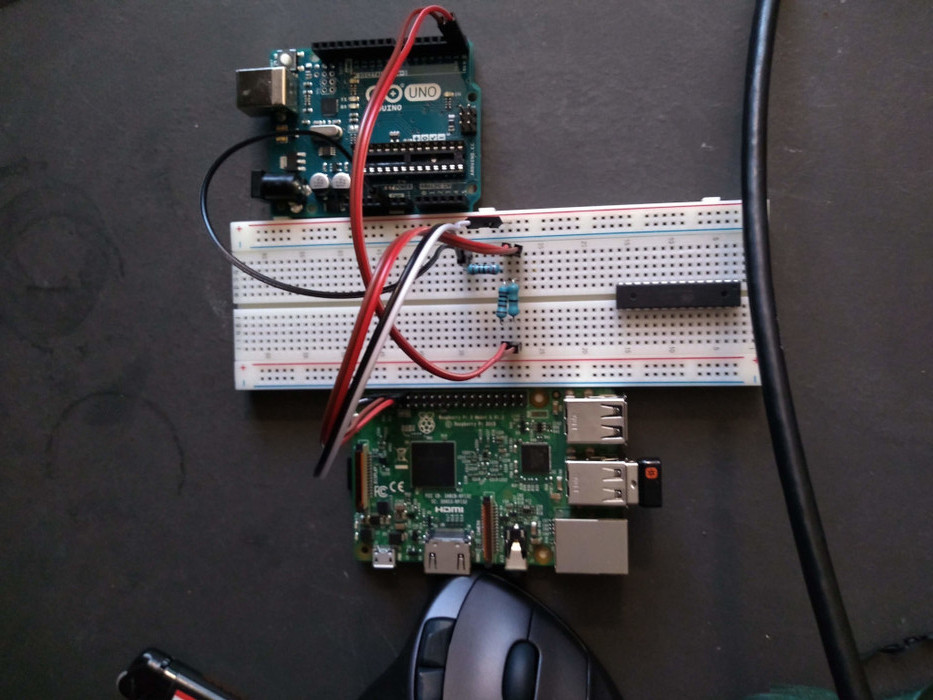

# rpi3serbtldr

Raspberry Pi 3 Serial Bootloader In Rust

## About
This project is part of Richard's Adventures in Rust Embedded.

FIXME: rx module has a sad and isn't ready for public release yet.

The repo contains two parts of a bootloader intended to assist in bare metal development on a Raspberry Pi 3. The first part is a receiver (rx) which runs on the Raspberry Pi as a bare metal application. The second part is a transmitter (tx) which runs on a PC. The bootloader uses the RPi's serial port and a simple protocol to upload a binary ARM executable file from the PC into the RPi's memory where it will be run.

## Installation

### Clone

Clone the repository into a local directory

### Build

I haven't figured out how to get cargo to only build the tx/rx subcrates from the top level. For now just run the build process from each directory. 

```
$ cd rpiserbtldr/tx
$ cargo build
$ cd rpiserbtldr/rx
$ cargo build
```

### Set Up SDCard

Because the Broadcom chip which the RPi3 is based on was designed in a way that makes the booting process complicated I use an SDCard that has been set up with the RPi foundations official Raspbian Linux and then make alterations to simplify the process.

**Install Raspian:**

 * Install Raspian Linux per instructions here: [https://www.raspberrypi.org/downloads/raspbian/]
 * Boot Rasbian Linux on the RPi to verify everything works.

**Disable booting Raspbian Linux by changing kernel file names:**

 * rename "/boot/kernel.img" to "/boot/kernel.img.nope"
 * rename "/boot/kernel7.img" to "/boot/kernel7.img.nope"

**Set RPi to enable UART for serial communication on boot:**

 * edit "/boot/config.txt" and add a line containing:
   ```
   enable_uart=1
   ```

**Replace kernel with receiver (rx):**

 * Copy rx program from build directory to "/boot/kernel8.img"

## Example Setup

In this example I use an Arduino Uno board with the microcontroller removed as a USB->Serial converter to let the host computer transmit the binaries to the Raspberry Pi 3.



### Arduino Board

USB-Serial converter per suggestion to remove the ATMEL chip as described here:

[https://create.arduino.cc/projecthub/PatelDarshil/ways-to-use-arduino-as-usb-to-ttl-converter-475533]

### Arduino Connector Notes:

 * Connector labelled TX is actually RX
 * Connector labelled RX is actually TX

### RPI3 Connector Notes:

 * Connector pin 6 is GND
 * Connector pin 8 is TX
 * Connector pin 10 is RX

### Resistor Divider Notes:

RPi UART0 uses 3.3v logic while the Arduino uses 5.0v logic requiring a passive resistor divider between the Arduino connector (labelled RX) and RPi connector pin 10 (RX). The Arduino seems to be able to handle the 3.3v signal from the RPi connector pin 8 (TX) just fine.

### Divider (Pictured):

 * A 1k Ohm resistor connects between the Arduino connector labelled RX and RPi connector pin 10 (RX).
 * A 2.2k Ohm resistor connects between RPi connector pin 10 (RX) and GND.
 * A 0 Ohm resistor connects between Arduino connector labelled TX and RPI connector pin 8 (TX)
 * The RPi Connector pin 6 (GND) and the Arduino connector labelled GND are connected.
